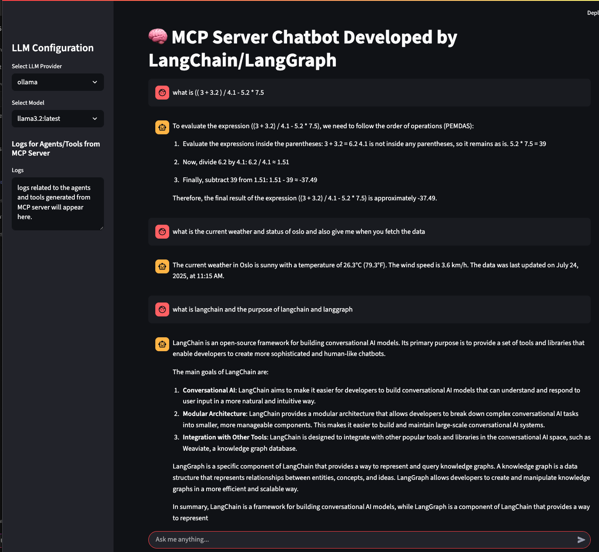

# MCP Server with LangChain, LangGraph, and Streamlit Frontend

This project demonstrates the flexibility and power of combining **LangChain**, **LangGraph**, and **Multi-Component Protocol (MCP)** to build a modular, LLM-powered server with a Streamlit frontend. It supports multiple LLM providers (Ollama and AWS Bedrock) and integrates tools for math, weather, Strava activity tracking, and RAG-based document QA.

---
## 🎯 Purpose
This repository showcases how to build a modular, scalable, and intelligent LLM-powered system using:

 - LangChain for chaining logic.
 - LangGraph for graph-based orchestration.
 - MCP for distributed tool routing.
 - Streamlit for a clean and interactive frontend.

It demonstrates how to integrate multiple LLMs and tools into a cohesive solution.

By using [MCP inspector](https://modelcontextprotocol.io/docs/tools/inspector) you track the number of added tools, resources and prompts in MCP server and also `MCP inspector` makes the debugging easy.
A screenshot of this AI-powered application can be seen below.
    <p align="center">
      
    </p>


---

## 🧱 Project Structure
```bash
.
├── documents
│   └── latest
│       ├── agents
├── main.py
├── mcp_server
│   ├── __init__.py
│   └── client.py
├── models
│   ├── __init__.py
│   ├── bedrock_model.py
│   └── ollama_model.py
├── pyproject.toml
├── README.md
├── requirements.txt
├── tools
│   ├── __init__.py
│   ├── math_tool.py
│   ├── rag_tool.py
│   ├── strava_api.py
│   └── weather_api.py
└── uv.lock

```

---

## 🚀 Features

- ✅ **Streamlit frontend** for user interaction
- ✅ **MCP client** routes tasks to appropriate agents
- ✅ **LangChain + LangGraph** for orchestration and LLM integration
- ✅ **Ollama & AWS Bedrock** as LLM providers
- ✅ **Tool agents** for:
  - Math operations
  - Weather information
  - Strava activity reports
  - PDF-based RAG QA

---

## 📦 Installation

1. **Install dependencies using uv:**

```bash
   uv pip install -r requirements.txt
```
Set up environment variables: 
  - Copy .env.example to .env:
```bash
   cp .env.example .env
```

  - Populate `.env` with your own configuration:
```bash
    ## AWS configuration
    AWS_ACCESS_KEY_ID=""
    AWS_SECRET_ACCESS_KEY=""
    AWS_SESSION_TOKEN=""
    AWS_REGION="eu-west-1"

    ## Weather API configuration
    WEATHER_URL="https://api.weatherapi.com/v1/current.json"
    WEATHER_API_KEY=""

    ## Web search API configuration
    WEB_SEARCH_API_KEY=""

    ## Strava API configuration
    STRAVA_CLIENT_ID=""
    STRAVA_CLIENT_SECRET=""
    STRAVA_ACCESS_TOKEN=""
    STRAVA_END_POINT="https://www.strava.com/api/v3/athlete"
```

---
## 🧠 LLM Models
# Ollama
  - llama3.2:latest (default)
  - orionstar/orion14b-q4:latest
  - prompt/hermes-2-pro
# AWS Bedrock
  - anthropic.claude-3-7-sonnet-20250219-v1:0
  - mistral.mixtral-8x7b-instruct-v0:1
  - anthropic.claude-3-haiku-20240307-v1:0
You can switch models dynamically via the Streamlit UI.

---

## 🧠 MCP Client Routing
The MCP client in mcp_server/client.py uses the following configuration to route tasks:
```bash
    client = MultiServerMCPClient(
        {
            "math": {
                "command": "python",
                "args": ["tools/math_tool.py"],
                "transport": "stdio",
            },
           "rag": {
                "command": "python",
                "args": ["tools/rag_tool.py"],
                "transport": "stdio",
            },
            "strava": {
                "url": "http://localhost:8001/mcp/",
                "transport": "streamable_http",
            },
            "weather": {
                "url": "http://localhost:8002/mcp/",
                "transport": "streamable_http",
            },
        }
    )
```
---
## 🛠️ Tool Agents
# 🧮 math_tool.py
  - Basic arithmetic: add, subtract, multiply, divide
  - Trigonometry: sin(x)
# 🚴 strava_api.py
  - Fetches athlete data from Strava
  - Provides:
    - Full report of latest activities
    - List of activities with name, distance, etc.
    - Summary and progress highlights
# 🌦️ weather_api.py
  - Returns weather data for a given city:

```bash
        {
        "city": "Oslo",
        "country": "Norway",
        "latitude": 59.91,
        "longitude": 10.75,
        "last_updated": "2025-07-23 12:00",
        "temperature_c": 22.5,
        "condition": "Partly cloudy",
        "wind_kph": 15.0
      }
```
---
## 📄 rag_tool.py
 - Reads PDFs from documents/
 - Answers questions using LangChain + LangGraph RAG pipeline
---
## 🖥️ Running the App
Start the Streamlit frontend:
```bash
  streamlit run main.py
```

- The default LLM model is llama3.2:latest (Ollama)
- You can ask questions and the app will route them to the appropriate agent via MCP